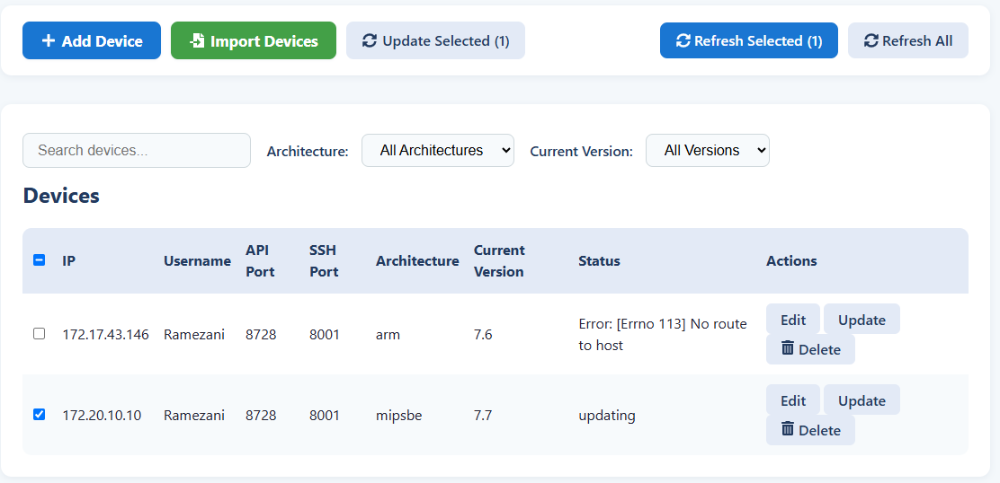
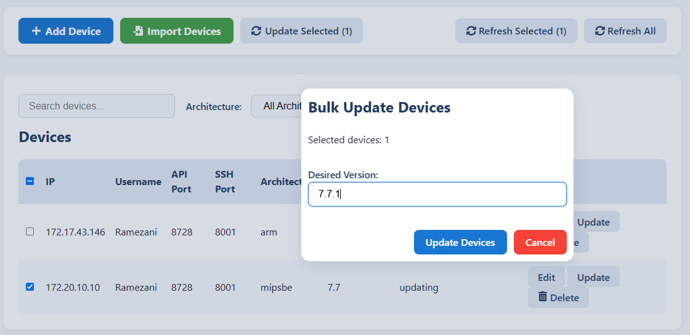
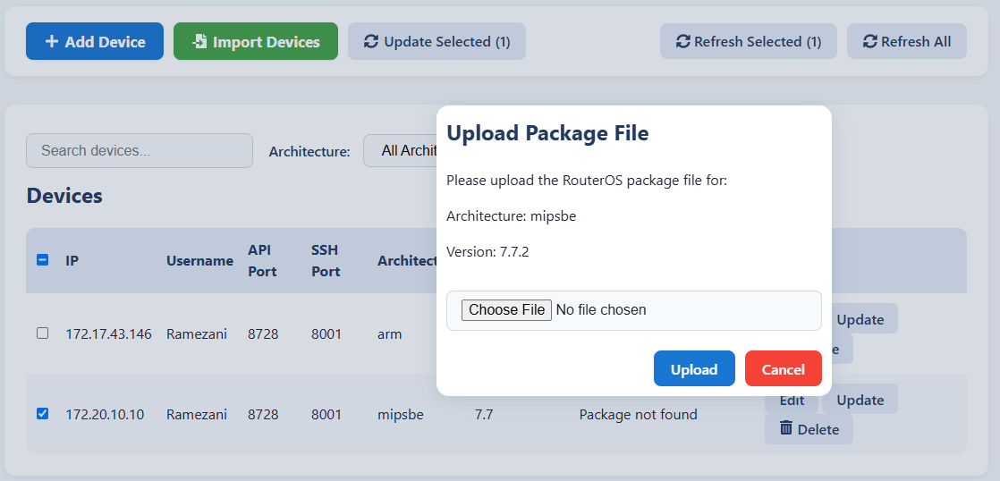

# MikroTik Update Manager (MUM)

A powerful web-based solution for managing and updating MikroTik RouterOS devices across your network. MUM provides a user-friendly interface to monitor, update, and maintain multiple MikroTik routers from a single dashboard.

## 🌟 Features

- **Centralized Management**: Manage multiple MikroTik routers from a single interface
- **Version Control**: Monitor and update RouterOS versions across your network
- **Architecture Support**: Handles different RouterOS architectures automatically
- **Secure Updates**: Secure package upload and deployment
- **Real-time Status**: Monitor device status and update progress
- **Bulk Operations**: Perform operations on multiple devices simultaneously

## 📸 Screenshots


*Device management dashboard*


*Uploading a RouterOS package file*


*Bulk device operations and update process*

## 🚀 Getting Started

### Prerequisites

- Python 3.8 or higher
- Node.js 14 or higher
- Access to MikroTik routers with API and SSH enabled

### Installation

1. Clone the repository:
```bash
git clone https://github.com/masoudigram/mikrotik-update-manager.git
cd mikrotik-update-manager
```

2. Set up the backend:
```bash
cd backend
python -m venv venv
source venv/bin/activate  # On Windows: venv\Scripts\activate
pip install -r requirements.txt
```

3. Set up the frontend:
```bash
cd frontend
npm install
```

### Configuration

1. Create a `devices.yaml` file in the backend directory:
```yaml
devices: []
```

2. Create an `os` directory in the project root to store RouterOS packages:
```bash
mkdir os
```

### Running the Application

1. Start the backend server:
```bash
cd backend
python app.py
```

2. Start the frontend development server:
```bash
cd frontend
npm start
```

The application will be available at `http://localhost:3000`

## 📝 Usage

1. **Adding Devices**:
   - Click "Add Device" in the interface
   - Enter the router's IP address, username, password, and ports
   - The system will automatically detect the architecture and current version

2. **Uploading Packages**:
   - Navigate to the package management section
   - Upload RouterOS package files (.npk) for different architectures
   - The system will organize packages by architecture

3. **Updating Routers**:
   - Select the target router(s)
   - Choose the desired RouterOS version
   - Initiate the update process
   - Monitor the progress in real-time

## 🔒 Security Considerations

- Store sensitive credentials securely
- Use strong passwords for router access
- Consider using SSH keys instead of passwords
- Keep the application behind a firewall
- Regularly update the application and dependencies

## 🤝 Contributing

Contributions are welcome! Please feel free to submit a Pull Request.

1. Fork the repository
2. Create your feature branch (`git checkout -b feature/AmazingFeature`)
3. Commit your changes (`git commit -m 'Add some AmazingFeature'`)
4. Push to the branch (`git push origin feature/AmazingFeature`)
5. Open a Pull Request

## 📄 License

This project is licensed under the MIT License - see the [LICENSE](LICENSE) file for details.

## ⚠️ Disclaimer

This tool is not officially affiliated with MikroTik. Use at your own risk and always backup your router configuration before performing updates. 